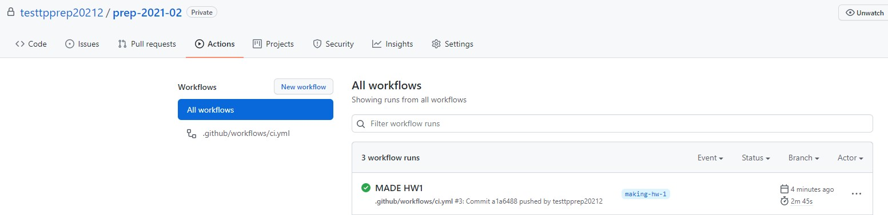
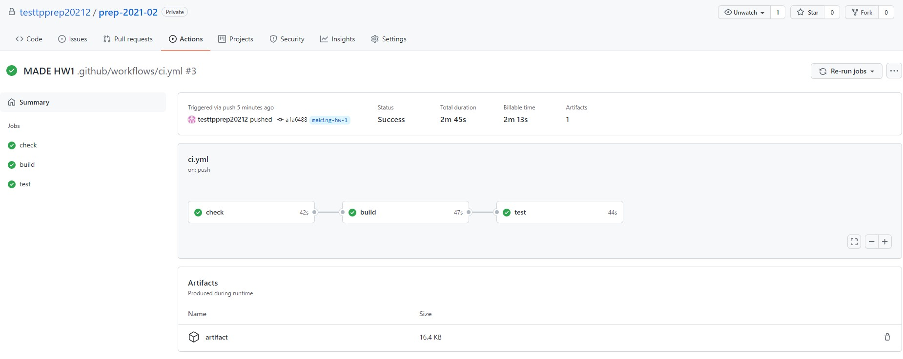

# Технопарк - Подготовительная программа по программированию на С/С++, весна 2022

## Домашнее задание №1
Вводное задание нашего курса, которое познакомит вас с нашей методикой приема ДЗ.

В папках **_project/include_** и **_project/src_** лежат исходники тестовой программы, которая через командную строку принимает следующие аргументы:
- **_номер кейса_** (целое число в диапазоне [1, 3]);
- входные данные для кейса:
  * для кейса 1 - **_целое число_** (./main.out 1 5');
  * для кейса 2 - **_два целых числа_** (./main.out 2 7 9);
  * для кейса 3 - **_целое число_** (./main.out 3 197);

Требуется:
1. Провести статический анализ кода: найти при помощи **_линтеров_** ошибки (в т.ч. замечания) в коде и исправить их (все кроме todo - ими вы займётесь в следующих пунктах).
Важно: этот пункт необходимо выполнять после каждого этапа ДЗ, т.к. будет появляться новый код, который может содержать замечания.
2. Найти и исправить ошибку в кейсе №1.
    * Чем проще - тем лучше.
    * Для облегчения поиска ошибки можно собрать программу при помощи **_make_**'а и позапускать с различными параметрами.
3. Реализовать функцию кейса №2 по ее прототипу.
    * Функция возвращает результат возведения **_base_** в степень **_pow_**.
4. Реализовать модуль для кейса №3 и добавить его в основную программу.
    * Модуль должен содержать функцию, определяющую является ли число, поданное на вход, простым: если да - вернуть 1, иначе 0.
    * Описание модуля и его реализация должны лежать в соответствующих .h и .c файлах.
    * [Не забудьте добавить исходники в **_Makefile_**](#Как-добавить-исходные-коды-в-makefile).
5. Реализовать возможность запуска кейса №4, который будет принимать на вход одно целое число и запускать функцию из отдельного модуля.
    * Модуль должен содержать рекурсивную функцию, которая выводит через пробел все целые числа от 1 до **n**, где **n** - параметр функции.
    * Описание модуля и его реализация должны лежать в соответствующих .h и .c файлах.
    * [Не забудьте добавить исходники в **_Makefile_**](#Как-добавить-исходные-коды-в-makefile).

**_Если вы нашли какие-либо неточности/ошибки или испытываете затруднения при решении - обращайтесь к преподавателям
(общий чат, сообщения на портале, на почту или в issues GitHub'а)._**

Если задание выполнено полностью верно, то после пуша в свою ветку на странице GitHub Actions вы увидите успешный запуск CI с 3 завершёнными этапами:
- тестирование стиля кода;
- сборка;
- тестирование собранного бинарника;




## Проверь себя!
Все команды, описанные ниже, выполняются из **_корневой_** директории проекта (один уровень с **_Makefile_**).

### Как собрать и запустить программу?
[Как использовать команды, подобные той, что ниже](#Использование-кодовых-вставок)
```bash
$ make clean && make
$ ./main.out 1 5
```

Не собирается:
- все ли ошибки, выявленные gcc, исправлены?
- все ли исходники указаны в **_Makefile_**?

### Как запустить статический анализ кода?
Статический анализ кода - это процесс выявления логических и стилистических ошибок в исходных файлах программ без их компиляции и исполнения.
Данный анализ избавляет программиста от багов, которые могут возникнуть вследствие его невнимательности. Программы, выполняющие статический анализ кода, называются **_статическими анализаторами_** или в простонародье - **_линтерами_**.

#### Необходимые зависимости
На вашей машине **_должны быть установлены_** утилиты make, [cppcheck](http://cppcheck.sourceforge.net/), утилита [clang-tidy](https://github.com/llvm/llvm-project/releases/tag/llvmorg-12.0.1) и [Python 3](https://www.python.org/download/).
Для Unix-подобных операционных систем можно воспользоваться встроенным пакетным менеджером. Например, на Linux Ubuntu можно выполнить следующие команды:
```bash
$ apt-get update -y
$ apt-get install -y python3 cppcheck clang-tidy make git python3-pip
$ python3 -m pip install cpplint
```

Немного более сложным, но полезным вариантом можно рассмотреть использование [Docker](https://docs.docker.com/get-started/), который поможет воссоздать ту же среду, что и в тестируемой системе. Для этого нужно
1. Скачать и установить Docker (на Windows и Mac - [Docker Desktop](https://www.docker.com/get-started), на Ubuntu - придётся устанавливать через [терминал](https://www.digitalocean.com/community/tutorials/docker-ubuntu-18-04-1-ru)) - это самый сложный этап!
Если всё установилось, то в терминале будет успешно работать команда:
```bash
$ docker ps
```
2. Чтобы зайти в виртуальный контейнер, достаточно ввести в том же терминале команду:
```bash
docker run -it leshiy1295/gcc_linters bash
```
Если всё успешно - вы окажетесь внутри этого контейнера, в котором все необходимые программы уже предустановлены.

В результате в терминале должны выполняться следующие команды (точные версии могут отличаться)
```bash
$ cppcheck --version
Cppcheck 2.3
$ clang-tidy --version
LLVM version 11.0.1
$ cpplint --version
Cpplint fork (https://github.com/cpplint/cpplint)
cpplint 1.5.5
$ python3 --version
Python 3.9.2
$ git --version
git version 2.30.2
$ make --version
GNU Make 4.3
```

Если после установки какого-то из инструментов выдаётся ошибка о неизвестной команде - вероятно, установщик не сообщил операционной системе, где искать эти файлы, поэтому это придётся сделать вам самим. Для этого нужно добавить путь до папки с установленной утилитой (не корневой, а той, где находится непосредственно установленная программа - обычно это подпапка bin в корневой директории) в переменную окружения PATH. На Unix-подобных системах для этого необходимо добавить строчку вида в конец файла ~/.profile:
```bash
PATH="/path/to/dir:$PATH"
```
где вместо `/path/to/dir` нужно будет указать ту самую директорию, о которой выше шла речь.

### Запуск линтеров
```bash
$ make check

***** RUN cppcheck *****
Checking project/src/main.c ...
1/2 files checked 50% done
Checking project/src/utils.c ...
2/2 files checked 100% done
[*]: (information) Unmatched suppression: missingIncludeSystem

***** RUN clang-tidy *****

***** RUN cpplint.py *****
Done processing project/include/utils.h
Done processing project/src/main.c
Done processing project/src/utils.c
Total errors found: 0

***** SUCCESS *****
```

### Как запустить тесты?
```bash
$ make test
............SUCCESS
```

#### Тест не пройден. Причина?

##### Код возврата программы не совпадает с ожидаемым
```bash
$ make test
TEST ./btests/0.0.tst FAILED. INVALID EXIT STATUS
EXPECTED:
255
RECEIVED:
0
```
Мы видим, что тест ./btests/0.0.tst не прошёл.

Ожидалось, что программа завершится с кодом 255, а был получен 0.

##### Вывод программы не совпадает с ожидаемым
```bash
$ make test
..TEST ./btests/1.0.tst FAILED
EXPECTED (2 symbols):
12
RECEIVED (1 symbols):
8
```
Мы видим, что тест ./btests/1.0.tst не прошёл.

В стандартном выводе программы ожидалось "12", а было получено "8".

#####  Что делать?
Смотрим содержимое непрошедшего теста (**_файл .tst_**), узнаём с какими ключами (KEYS) была запущена программа, что было подано ей на вход (IN) и какой вывод (OUT) и код возврата (STATUS) ожидались.

Пробуем повторить тест руками.

## Дополнения

### Использование кодовых вставок
Все кодовые вставки в данном документе подчиняются следующим правилам:
#### Если перед строкой стоит знак **_$_**, значит это команда, которая запускается в терминале. Пример:
```bash
$ ls
$ ./test
```
Здесь выполняются 2 команды: **_ls_** и **_./test_**.
Чтобы выполнить их у себя на компьютере, необходимо скопировать все, что находится за символом **_$_**.
#### Если перед строкой не стоит символа **_$_**, значит это вывод программы, которая была выполнена выше. Пример:
```bash
$ ls
test 123 somedir
```
Здесь была выполнена команда **_ls_**, которая выдала в терминал текст **_test 123 somedir_**. Эти строки даны для
ознакомления с примером вывода программ.

### Как добавить исходные коды в Makefile
Если вы добавляете в проект еще один файл исходных кодов, для того чтобы он успешно собирался, необходимо добавить его в
файл **_Makefile_**.
Напомним, что **_Makefile_** является составным конфигурационным файлом для утилиты [make](https://www.gnu.org/software/make/).

Пример конфигурационного файла:
```Makefile
TARGET = main.out
HDRS_DIR = project/include

# XXX: Don't forget backslash at the end of any line except the last one
SRCS = \
       project/src/main.c \
       project/src/utils.c

.PHONY: all clean

all: $(TARGET)

$(TARGET): $(SRCS)
	$(CC) -Wpedantic -Wall -Wextra -Werror -I $(HDRS_DIR) -o $(TARGET) $(CFLAGS) $(SRCS)

clean:
	rm -rf $(TARGET)
```

В данном примере, проект состоит из 2х файлов исходных кодов: **_project/src/main.c_** и **_project/src/utils.c_**.
В случае, если вам необходимо добавить еще один файл в проект, необходимо добавить путь к файлу в переменную **_SRCS_**.

Например, чтобы добавить файл **_project/src/some.c_**, отредактируйте **_Makefile_** следующим образом:
```Makefile
SRCS = \
       project/src/main.c \
       project/src/utils.c \
       project/src/some.c
```

Обратите внимание, что после **_utils.c_** появился знак переноса строки (символ **_/_**) тогда как после
**_some.c_** его нет. Знак переноса строки должен присутствовать во всех строках кроме последней.

Обратите также внимание на то, что в списке исходных текстов указываются только файлы с расширением **_.c_**.
Заголовочные файлы указывать в списке не нужно.

## Как оценивается работа
Полный балл за задачу ставится, если:
- выполнены все пункты 1-5, на CI нет никаких ошибок и замечаний, при этом код тестов/инфраструктуры не изменён;
- в Pull Request все изменения "заребейжены" на ветку с заданием, т.е. все коммиты с заданием расположены строго раньше всех коммитов решения;
- интерфейс функций из задания не изменён;
- нет копипасты - всё вынесено в отдельные функции;
- во всех функциях проверяется корректность входных контрактов, при невыполнении они возвращают ошибку, самостоятельно ничего не выводя;
- принцип единственной ответственности соблюдается во всех функциях;
- нет захардкоженных констант - все они вынесены в enum или хотя бы в define;
- все переменные и функции названы ясно, без сокращений. Лишних переменных (не несущих смысловой нагрузки) нет;
- в рекурсии не используются статические переменные.
