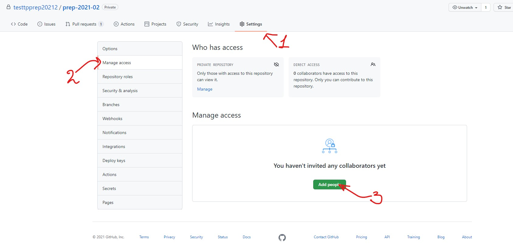
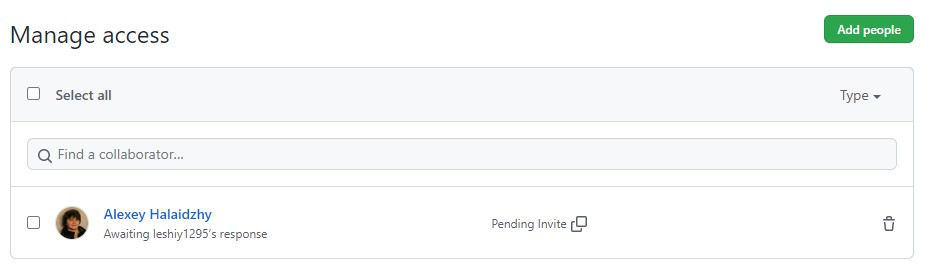
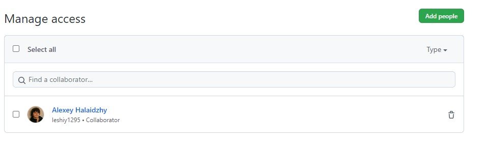
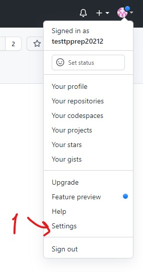
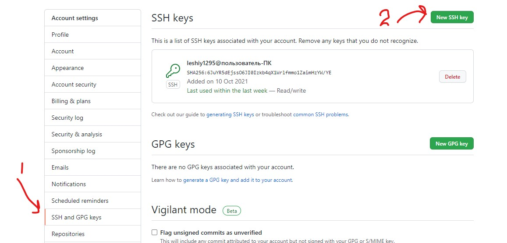
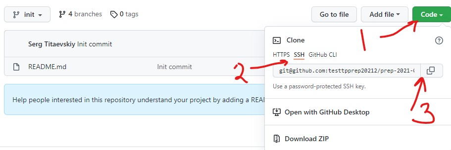
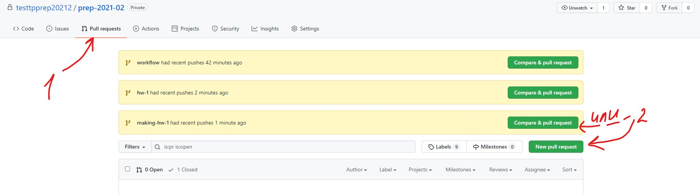
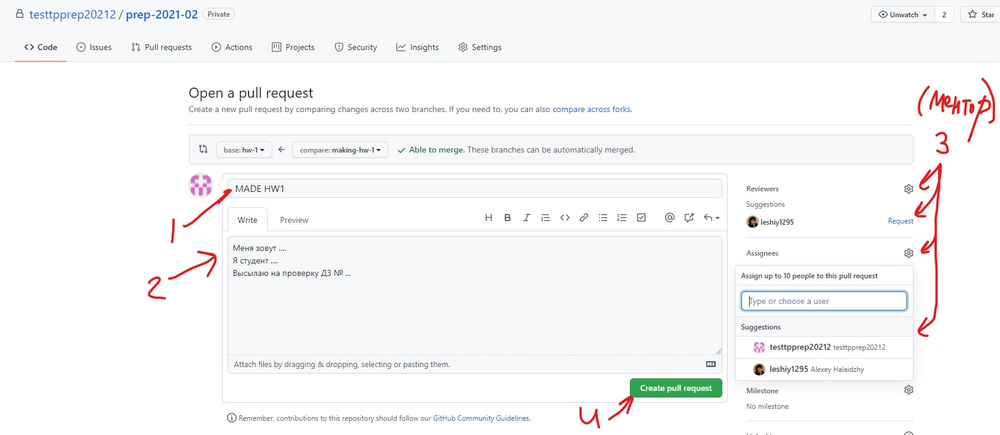

# Описание основного процесса работы выполнения домашних заданий #

## Подготовка
Необходимо создать приватный репозиторий, добавить в неё upstream на официальный репозиторий курса и добавить ментора и преподавателя, привязанных к вашей команде, с правами **Developer**.



Ддобавляем ментора в проект:


Ждём подтверждения ментора:


### Настройка доступа в репозиторий на GitHub

Для того, чтобы иметь возможность сохранять изменения кода на вашем компьютере на GitHub, нужно
"сообщить" гитлабу каким образом идентифицировать ваш компьютер.

Для этого существует поняние ssh-ключей. Для генерации пары открытый/закрытый ssh-ключ исполните следующие команды.

[Как использовать команды, подобные той, что ниже](#Использование-кодовых-вставок)
```bash
$ mkdir -p ~/.ssh
$ chmod 700 ~/.ssh
$ ssh-keygen -t rsa
Generating public/private rsa key pair.
Enter file in which to save the key (/Users/p.bereznoy/.ssh/id_rsa):
Enter passphrase (empty for no passphrase):
Enter same passphrase again:
Your identification has been saved in /tmp/test.
Your public key has been saved in /tmp/test.pub.
The key fingerprint is:
SHA256:9Yf53peICFiHtsvlLTU+lnMidP9Vd7U7aWtSE9GWyIs p.bereznoy@msk-wifi-21fap7-p_berezhnoy-noname.mail.msk
The keys randomart image is:
+---[RSA 2048]----+
|            . . o|
|             o oo|
|        . . . ..o|
|       + o E + .o|
|      + S   + ..=|
|     . o o + o o*|
|      . * * = +=+|
|       o = X *.+=|
|          + = =oo|
+----[SHA256]-----+
```

Если вы не уверены, что готовы потратить пару часов на разбирательство "почему оно не работает", **не меняйте
путь к ключу**, который предлагает утилита (строка "Enter file in which to save the key"), просто нажмите Enter.

Если вам не нужен пароль для ключа (большинству не нужно), тоже просто нажмите Enter.

В результате у вас были сгенерированы 2 файла:
```bash
$ ls ~/.ssh
id_rsa id_rsa.pub
```

Необходимо скопировать содержимое файла **id__rsa.pub** на гитлаб:
```bash
$ cat ~/.ssh/id_rsa.pub
ssh-rsa
AAAAB3NzaC1yc2EAAAADAQABAAABAQD9nu0UpP/5txdI9CkOkIj3N4A0wdQ8Skm1s6mISmPmq6efOLJH5JEJ3oEOWvFBZOGMzR0QfJ9UOWy02/+YEXAJ9hMKoenaKHovTXhL6i9T99bD9TDouWh9kR4XbDht2pcmEzRkvgKh+xSwqDt7IwShdQtBr93j9H/z5pL38mKOz98TLGEBXDJMOH0QGHk/FPRiVGQl6HxNOa7wGzYR1fMgWMK5qX6S/81dRMOWjgm3QvpUiNwk3POhkLcO5YOV+H3zxb65KzDXixScQBRBWGUqKzc2qoyoG84m7LirGHc5moH+q5Ieo+nC5l0NOd3sKqq5XL5L2ZmNoErM2WVQZKnz
p.bereznoy@msk-wifi-21fap7-p_berezhnoy-noname.mail.msk
```

Далее необходимо скопировать ключ на гитхаб:




### Клонирование репозитория



Для того, чтобы получить копию своего репозитория на компьютер, сначала скопируйте его URL (Clone with SSH не потребует ввода имени пользователя и пароля GitHub, в отличие от Clone with HTTPS):

Затем воспользуйтесь командой:
```bash
$ git clone "URL"
```

### Локальные настройки GIT'а

Просим вас исполнить следующие команды для конфигурирования вашего локального гита.

Настройки принадлежности ваших коммитов:
```bash
$ git config --global user.name "Your Name Surname"
$ git config --global user.email "your@e.mail"
```

Следующая команда необходима для того, чтобы пушить на гитлаб только текущую ветку.
Необходимо **ВСЕМ**.
```bash
$ git config --global push.default current
```

Некоторые цветовые настройки. Будет красиво:
```bash
$ git config --global color.branch true
$ git config --global color.interactive true
$ git config --global color.diff true
$ git config --global color.grep true
$ git config --global color.status true
```

## Получение следующих дз

Для того, чтобы новые дз появлялись в вашем форке, воспользуйтесь ручным зеркалированием.

Добавьте преподавательский репозиторий в список удаленных репозиториев (делается один раз):
```bash
$ git remote add upstream "URL"
```

Для добавления всех изменений в локальный репозиторий:
```bash
$ git fetch --all
```

Для добавления ветки в ваш репозиторий:
```bash
$ git checkout hw-num
$ git push origin
```

## Выполнение
Каждое задание находится в отдельной ветке с именем **hw-_num_**, где _num_ - номер задания.
Описание задания находится в каждой ветке в *README.md*: его нужно выполнить, закоммитить и отправить на сервер.
На каждый пуш GitHub запустит CI (GitHub Actions), который: проверит стиль кода, соберет проект, прогонит различные тесты.

**Note: все линтеры, сборщики и тесты находятся в той же ветке, что и задание. Их можно и нужно запустить локально,
 перед отправкой на сервер**

Перед тем как начать делать задание, вам необходимо создать новую ветку с любым удобным именем
(например, **making-hw-_num_**, _num_ - номер задания) от ветки **hw-_num_**:
```bash
$ git checkout hw-1
$ git push
$ git checkout -b making-hw-1
```

После этого нужно делать домашнее задание в этой ветке.

## Защита
После успешного прогона CI вы можете отправить задание на проверку.
Для этого нужно сделать **Pull Request** вашей ветки ( **making-hw-_num_** в примере)
в ветку **hw-_num_** (_num_ - номер задания).

**Note: Pull Request необходимо делать в свой репозиторий!**





На все замечания будут открыты дискуссии и выставлена предварительная оценка. Как будут запушены все всправления - пишите в комменты.

**Note: выполненным и защищенным будет считаться задание со смёрдженным преподавателем PR'ом и закрытыми дискуссиями.**
Если вы сами закроете дискуссии или сами вмержите код, оценка на портал не попадет. Ее проставляет все равно препод.

## Дополнения

### Использование кодовых вставок
Все кодовые вставки в данном документе подчиняются следующим правилам:
#### Если перед строкой стоит знак **_$_**, значит это команда, которая запускается в терминале. Пример:
```bash
$ ls
$ ./test
```
Здесь выполняются 2 команды: **_ls_** и **_./test_**.
Чтобы выполнить их у себя на компьютере, необходимо скопировать все, что находится за символом **_$_**.
#### Если перед строкой не стоит символа **_$_**, значит это вывод программы, которая была выполнена выше. Пример:
```bash
$ ls
test 123 somedir
```
Здесь была выполнена команда **_ls_**, которая выдала в терминал текст **_test 123 somedir_**. Эти строки даны для
ознакомления с примером вывода программ.
